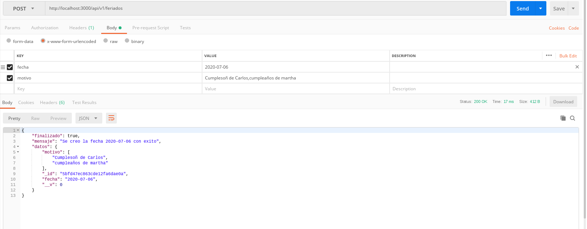
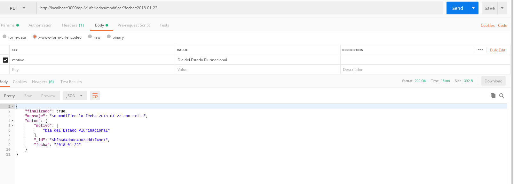
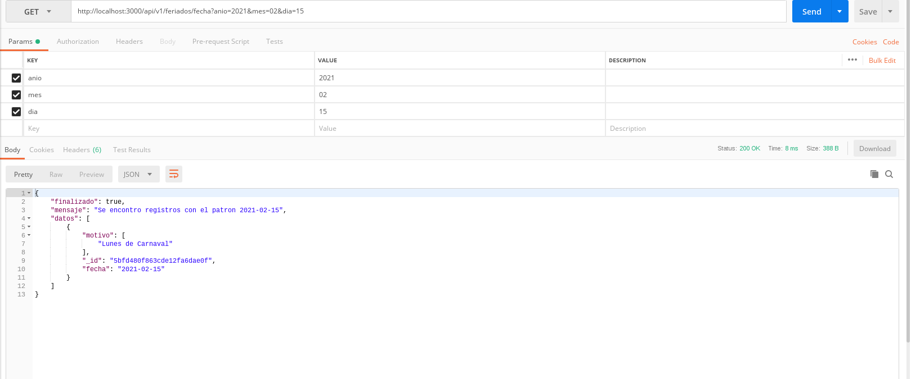
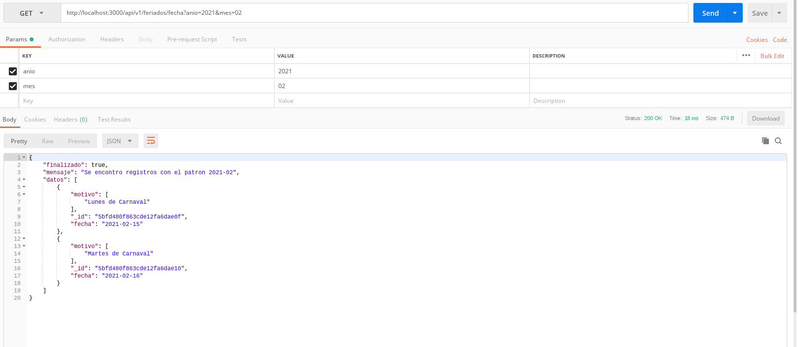
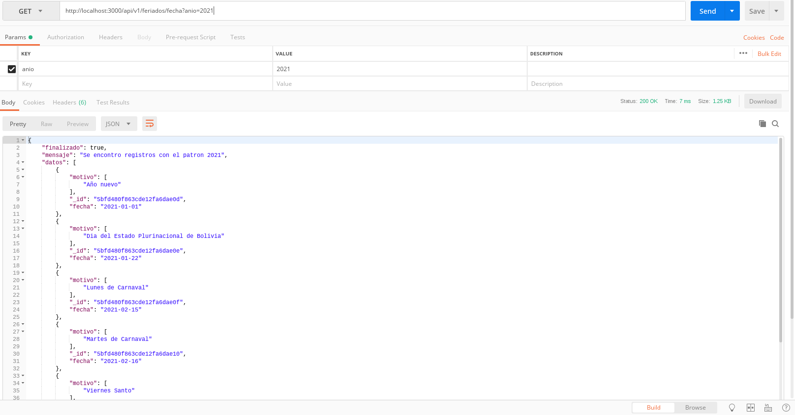
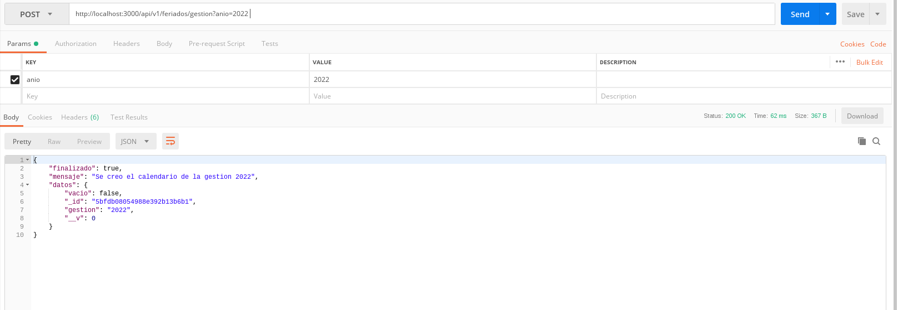
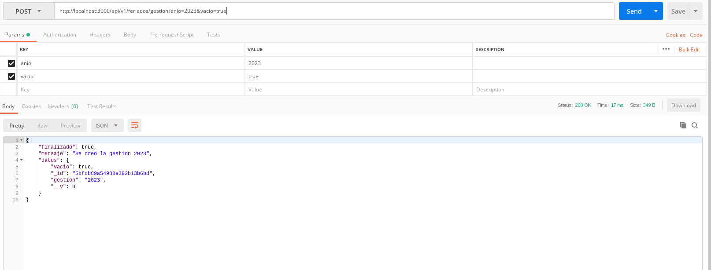
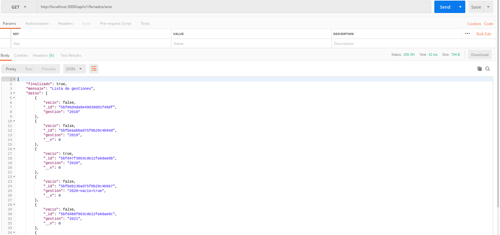
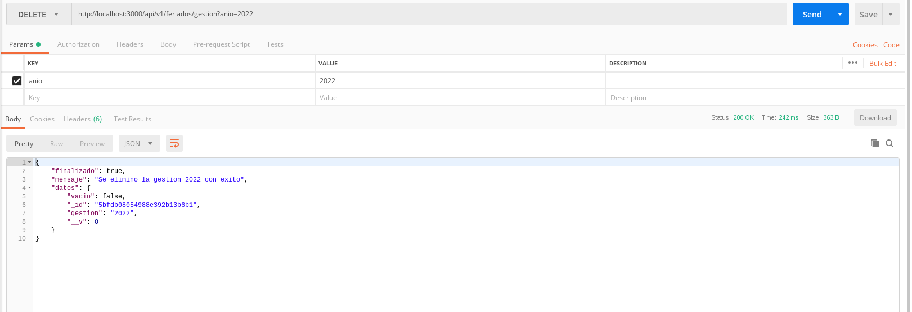

# Microservicio Para Obtener Días Feriados-Festivos

## Modo de funcionamiento

Para el funcionamiento de la aplicación tenemos las siguientes rutas:

## Listar Fecha

Con esta función GET nosotros podemos listar todas las fechas agregadas.

    http://localhost:3000/api/v1/feriados

.. Nota: Una fecha puede tener mas de una celebración. Para agregar mas de una celebración debe colocar una coma entre cada celebración.

## Agregar Fecha

Con esta función POST podemos visualizar las fechas de forma genérica.

    http://localhost:3000/api/v1/feriados

Se deben agregar los siguientes campos:

* fecha. La fecha que se quiere agregar. Preferentemente la fecha debe tener este formato:

    año-mes-dia

* motivo. El motivo o feriado que se esta celebrando en esa fecha.

## Modificar una Fecha

Con esta función PUT podemos modificar una fecha.

    http://localhost:3000/api/v1/feriados/modificar

Donde se puede modificar el motivo de la fecha.

## Búsqueda de una Fecha

Con esta funcion GET podemos hacer la búsqueda de una fecha

    http://localhost:3000/api/v1/feriados/fecha

Parámetros en entrada:

* anio. Año

* mes. Mes

* dia. Dia

Se debe colocar en ese orden los parámetros

## Búsqueda por Gestión y Mes

Con esta función GET podemos buscar los feriados por la gestión y por mes 

    http://localhost:3000/api/v1/feriados/fecha

Parámetros en entrada:

* anio. Año

* mes. Mes

Se debe colocar en ese orden los parámetros

## Listar Calendario por Gestión

Con esta función GET podemos visualizar todo el calendario de feriados de toda una gestión, poniendo como parámetro el año.

    http://localhost:3000/api/v1/feriados/fecha

Parámetros en entrada:

* anio. Año

## Dar de Baja una Fecha   

Con esta función DELETE hacemos el borrado de una fecha. Manejamos una variable public para hacer que nuestra fecha sea visible. Si modificamos esa variable entonces esta solo se hará no publica.

    http://localhost:3000/api/v1/feriados/borrar

## Generar Calendario por Gestión

Esta función POST es la mas bonita. Con esta generamos el calendario de toda una gestión colocando como parámetro de entrada el año en cuestión.

    http://localhost:3000/api/v1/feriados/gestion

donde debemos introducir estos parámetros:

* anio. Es el año de la gestion que queremos generar.

## Crear una Gestión en Cero

Con esta función  POST podemos crear una gestión sin feriados.

    http://localhost:3000/api/v1/feriados/gestion

donde debemos introducir estos parámetros:

* anio. Es el año de la gestión que queremos generar.

* vacio. Se debe colocar true para que generemos el calendario vacío.

## Listar Gestiones

Con esta función GET podemos visualizar todas las gestiones.

    http://localhost:3000/api/v1/feriados/anio

## Borrar Toda una gestión

Con esta función DELETE podemos borrar toda una gestión, incluido el año y sus feriados respectivos.

    http://localhost:3000/api/v1/feriados/gestion

## Status

Esta función nos muestra si la api esta disponible o no

    http://localhost:3000/api/v1/status